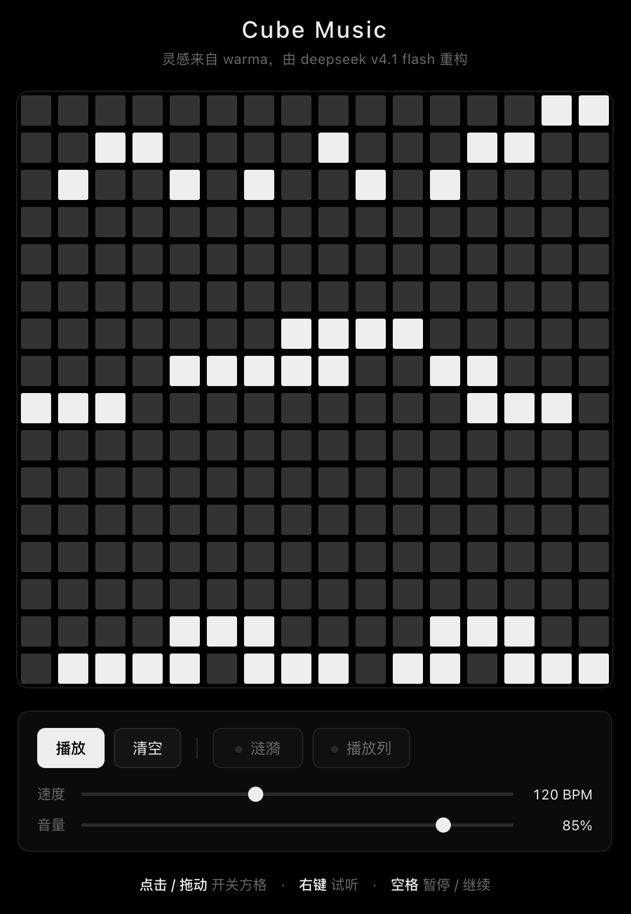

# Cube Music

**Cube Music** 是一个放在浏览器里的 16×16 音乐盒：点亮格子，它就会一圈一圈地循环演奏。

不用安装任何东西，打开网页就能玩。

  

## 在线试玩

**[harukiinharu.github.io/cube-music](https://harukiinharu.github.io/cube-music/)**

## 怎么玩

| 你做的操作 | 会发生什么 |
|---|---|
| 左键点一下某个格子 | 打开 / 关掉这个音符 |
| 按住左键拖动 | 连续涂一片 |
| 右键某个格子 | 单独听一下这个音 |
| 空格 | 暂停 / 继续 |
| 「清空」按钮 | 全部擦掉 |

下方还有几样可以调的：

- **速度** —— 循环有多快（40 ~ 240 BPM）
- **音量** —— 声音大小
- **涟漪** —— 点亮格子时那一圈会发光的波纹，不喜欢可以关掉
- **播放列** —— 一条淡淡的竖线，标记现在循环到哪一列

## 它是怎么发声的

16 列就是一小节里的 16 步，从左到右循环播放；从上到下则是从 A6 到 A3 的一串
D 大调五声音阶。因为只用五个音，所以**随手乱点也不会难听** —— 把几个格子摆成
某种形状，往往就是一个好听的琶音。

## 关于

- 灵感来自 [【warma实况】Cube Music](https://www.bilibili.com/video/BV1as411q7ax)
- 由 **DeepSeek v4.1 Flash** 重构实现
- 原型是 2009 年 Hobnox AudioTool 里的 **ToneMatrix** —— 一个 Flash 音乐玩具。
  这里用原生 JavaScript + Canvas + Web Audio 把它重写了一遍：
  无框架、无构建、无依赖，整个项目就是一个网页

## 本地运行

把仓库下载下来，双击 `index.html` 就能玩，仅此而已。
